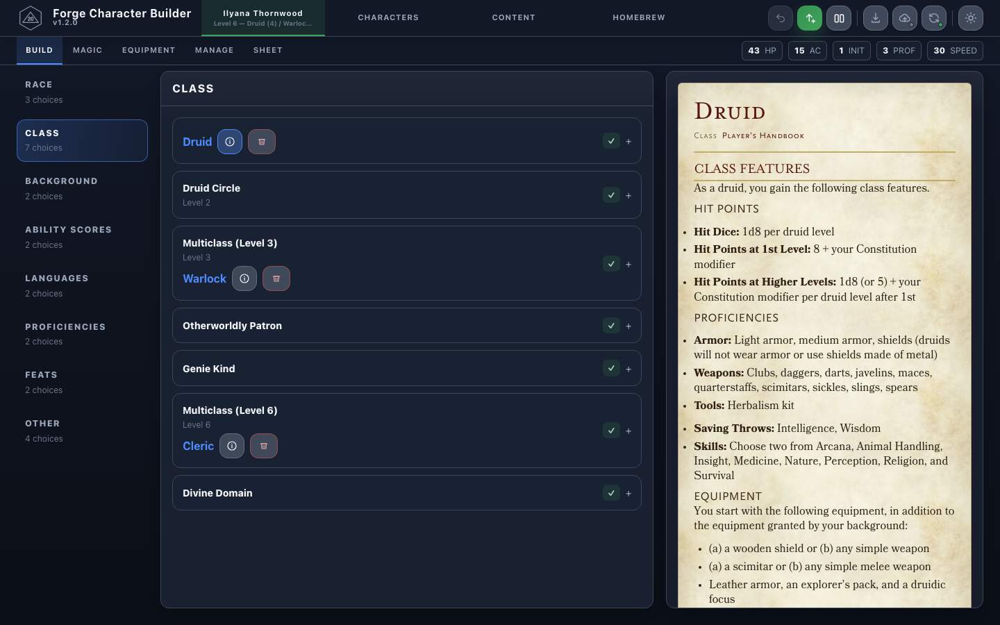
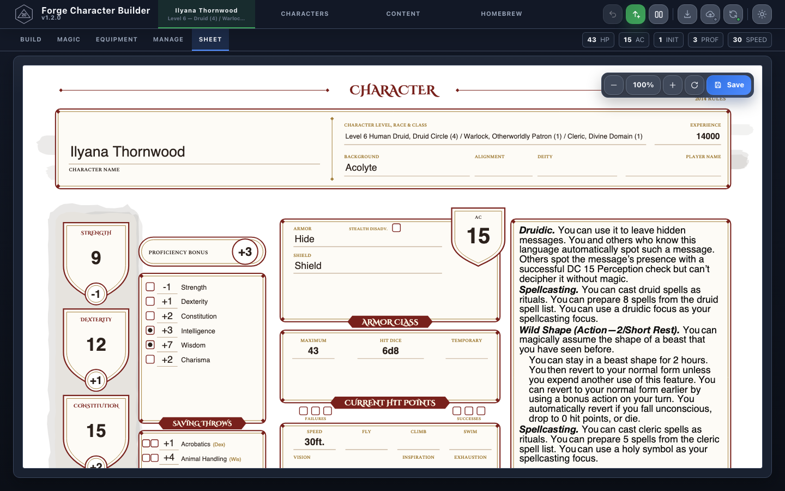
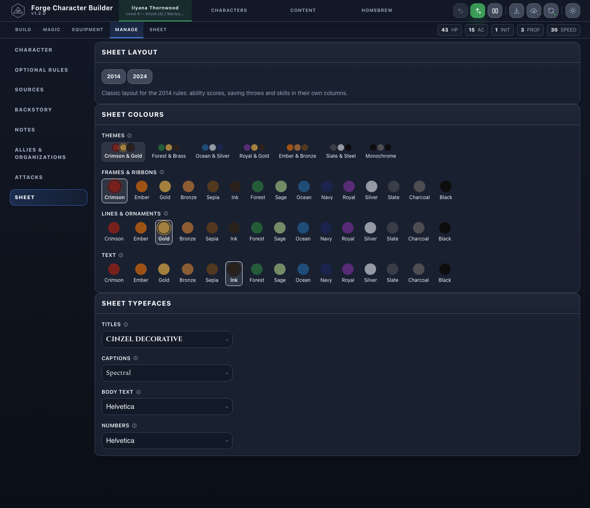
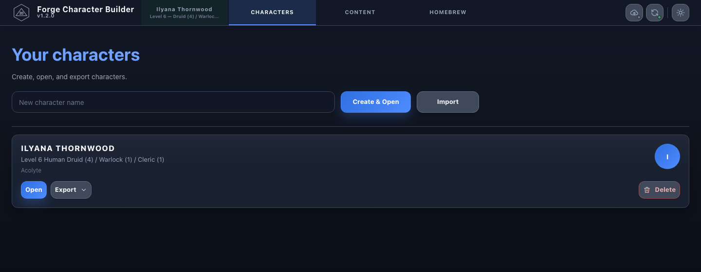

# Forge Character Builder

A character builder for Dungeons & Dragons 5th edition that runs entirely in
the browser. It builds characters from content XML, walks them through
selections and levels, derives their statistics, and produces character sheet
PDFs and virtual-tabletop exports. Characters are stored on the device; there
is no server component.

The repository holds three packages:

| Path | What it is |
|---|---|
| `packages/engine` | The rules engine: content library, `.dnd5e` parse/serialize, character state, selection, leveling, statistics, magic, inventory, attacks, sheet model and PDF writer, snapshots. |
| `packages/api` | The wire contract: protocol envelopes, error codes, the typed RPC method map, and the worker runtime. |
| `apps/client` | The React client — worker transport, IndexedDB persistence, sheet preview, cloud sync, VTT export. |

Bundled content lives under `apps/client/public/content` (the core rules
baseline and the System Reference Document 5.1 and 5.2.1 subsets), the sheet
templates under `apps/client/public/sheets`, and the credits page under
`apps/client/public/legal`. See [Content](#content) for how each is produced.

## Screenshots

Building a character: selections and levels on the left, the chosen option's
rules on the right.



The sheet tab renders the character sheet as a PDF, in the browser.



Sheet settings choose the layout, the colours and the typefaces.



Characters are saved on the device.



## Getting started

```bash
npm install
npm run build           # tsc -b (all packages)
npm test                # engine + api unit tests
npm run client:dev      # run the client locally with hot reload
```

The engine test suite that exercises the full content corpus needs the corpus
fetched once (`npm run corpus:fetch`); see [Content](#content).

### Commands

```bash
npm run build           # tsc -b (all packages)
npm test                # engine + api unit tests
npm run test:coverage   # unit tests with coverage thresholds (CI-enforced)
npm run coverage:gate   # corpus coverage gate
npm run lint

npm run client:dev      # run the client locally with hot reload
npm run client:build
npm run client:test
npm run verify:browser  # production-artifact smoke run (build the client first)

npm run content:build-srd   # regenerate the shipped SRD subsets from the corpus
npm run content:check-srd   # fail on drift between the generator and the committed files
npm run sheets:build        # regenerate the sheet templates and their label sheets
npm run sheets:check        # fail on drift between the generator and the committed templates
npm run audit:public        # check the tracked tree for terms, files and secrets that must not ship
```

## Architecture

The engine is a plain TypeScript library with no browser dependencies. The
client runs it in a Web Worker behind the typed RPC contract in
`packages/api`, keeps characters and uploaded content in IndexedDB, and renders
sheets in a second worker so PDF work never blocks the editor.

- [docs/content.md](docs/content.md) — what the bundled content is and how each part is produced.
- [docs/contract.md](docs/contract.md) — the RPC surface, its DTOs and guarantees.
- [docs/integration.md](docs/integration.md) — embedding the engine in another host, in-process or in a worker.
- [docs/host-shell.md](docs/host-shell.md) — how a host site brands the client without forking it.
- [docs/google-drive-sync.md](docs/google-drive-sync.md) — the optional Google Drive sync and the OAuth client it needs.
- `packages/engine/src/public-api.test.ts` — a runnable worked example of the engine API.

### Frozen compatibility contracts

These identifiers are persisted in users' browsers and cloud storage and must
never be renamed:

- the IndexedDB database's schema version and store names — see
  `apps/client/src/transport/localStore.js`;
- exported `.dnd5e` element identifiers and document byte-fidelity;
- the Google Drive folder `DM Forge`, the library file `dm-forge-library.json`,
  and their `appProperties` tags — see `apps/client/src/cloud/`;
- browser persistence names — the IndexedDB database `fcb-local` and the
  localStorage keys `theme`, `fcb-autosave`, `fcb-active-character`,
  `fcb-split-view`, `fcb-sheet-template`, `fcb-sheet-colours`, `fcb-sheet-fonts`
  — which a host may replace through `shell.storage` (see
  [docs/host-shell.md](docs/host-shell.md)) but must then never change;
- the snapshot manifest identities in
  `packages/engine/src/snapshot/identities.ts`, whose parser/schema pins move
  in lockstep with `apps/client/src/transport/fastStartSnapshot.js` and
  `packages/engine/src/snapshot/finalization-revision.test.ts`.

## Content

The builder reads the `.dnd5e` character format and the content XML format it
is built on. Everything the client ships is under `apps/client/public/content`
and is the source of truth for what users get:

- `content/core` — the rules baseline every edition shares (authored).
- `content/system` — the engine's own system elements (authored).
- `content/srd-5.1` and `content/srd-5.2.1` — the System Reference Document
  subsets for the 2014 and 2024 rules. Users can upload further content; the
  engine treats it exactly like the bundled files.

The two SRD subsets are generated rather than hand-edited, so an SRD update is
a regeneration, not a rewrite: `scripts/build-srd-content.mjs` slices them
from a public content corpus using the reviewed maps and denylists under
`third-party/srd-5.1` and `third-party/srd-5.2`, whose `provenance.md` files
record exactly which sources each file came from. The corpus is an optional
development dependency — never committed, fetched at a pinned commit and
byte-verified by `npm run corpus:fetch` — and is only needed to regenerate the
subsets or to run the corpus-backed engine tests (see [Contributing](CONTRIBUTING.md)).

Rules and SRD content are used under their applicable licences: System
Reference Document 5.1 under the Open Game License 1.0a, and System Reference
Document 5.2.1 under the Creative Commons Attribution 4.0 International
License. The notices ship with the client at `/legal/`, and `NOTICE.md` lists
every third-party component.

## Contributing

See [CONTRIBUTING.md](CONTRIBUTING.md). Changes are recorded in
[CHANGELOG.md](CHANGELOG.md).

## Support

Forge Character Builder is free and always will be. If it saves you time at the
table, you can [buy me a coffee](https://www.buymeacoffee.com/tommyruin3w).

## Licence

The code is under the MIT licence — see [LICENSE](LICENSE). Use it, change it,
ship it, sell it; keep the copyright notice.

The **bundled content is not MIT**. The System Reference Document material and
the third-party fonts, ornaments and libraries keep their own licences —
SRD 5.1 under the Open Game License v 1.0a, SRD 5.2.1 under CC BY 4.0, the
typefaces under the SIL Open Font License and CC BY-SA 4.0. Redistributing the
content means carrying those notices with it. Everything is listed in
[NOTICE.md](NOTICE.md) and shipped with the client at `/legal/`.
